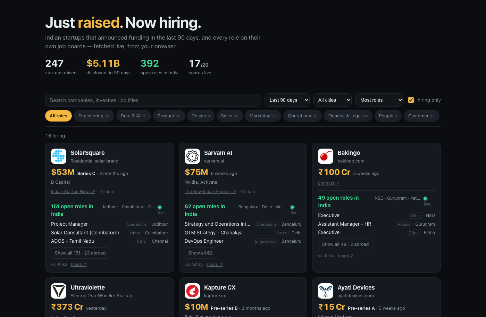

# Just Raised

**[aritrade1709.github.io/just-raised](https://aritrade1709.github.io/just-raised/)**

Indian startups that just raised money, and every role they're hiring for —
on one page, with the jobs fetched live from each company's own job board
when you open it.



## What it is

Funding announcements are where the hiring is, but they are scattered across
news sites and the jobs are on a different site again. This page joins the
two: every Indian startup that announced a funding round in the last 120
days — amount, round, investors, a link to the source — and the open roles
on its own job board, right there on the card. Nothing to sign up for,
nothing to install, no key.

## Using it

- The wall shows companies with open roles in India, newest round first.
  Untick **hiring only** to see every round, including companies with no
  public job board (those get a careers link instead).
- **Role chips** — Engineering, Data & AI, Product, Design, Sales… — filter
  the roles on every card and hide cards with none.
- **City**, **window** (30 / 60 / 90 / 120 days) and **sort** (newest,
  biggest round, most roles) are in the bar. Search matches company names,
  investors and job titles.
- **Show all N** expands a card to every role, with roles outside India
  listed after them. Each role links to the application page on the
  company's board.
- Filters live in the URL hash, so a view can be shared:
  `#family=Data+%26+AI&city=Bengaluru&days=60`.

## How it works

The site is static. A nightly job produces one JSON file; the page renders
it, then refreshes every job board live.

### 1. Funding rounds come from headlines

There is no free, keyless source of Indian funding events, but funding
headlines are formulaic — *"Cardless payments platform Piston raises $15 Mn
in Series A led by FPV Ventures"* — and Google News RSS accepts `after:` and
`before:` operators, so four months of Indian funding is about 180 requests.
Entrackr, Inc42 and YourStory feeds add the freshest items with real article
URLs.

A parser (`src/shared/headline.ts`, with ~70 real headlines as tests) turns
each headline into company, descriptor, amount, currency, round and
investors. It is deliberately conservative: a headline needs a raise verb
*and* money, a round or a funding word; VC funds, corporates, IPOs, orders,
grants and person-led ledes are rejected; the company name is the run of
capitalised words after the last descriptor ("*Deep-tech cybersecurity
company* **QNu Labs**"). Sightings of the same company within three weeks
merge into one round, and the most-reported amount wins. A round whose only
India signal is the word "India" in passing is kept only if the company's
own site says India too.

### 2. Companies are joined to job boards with no shared key

Nothing in a headline says where a company's jobs live. The resolver
(`scripts/lib/domain.ts`, `scripts/lib/discover.ts`) does the join in two
steps.

**Company → website.** Clearbit's autocomplete gives candidate domains, plain
domain guessing adds more (`name.com`, `name.in`, `name.ai`, `myname.app`…),
and every candidate is validated by fetching the homepage and finding the
company's name in the title, an `og:` tag or the domain itself — a page that
merely mentions the company does not count. Among validated candidates, one
that names India wins, then one that mentions what the headline said the
company does. Big consumer sites that wall off non-browser clients are
accepted on Clearbit's exact name match alone.

**Website → job board.** The resolver walks the homepage and its careers
pages looking for the applicant-tracking system the company itself links
to: Greenhouse, Lever, Ashby, SmartRecruiters, Workable, Darwinbox, Keka,
Zoho Recruit, JazzHR, and link-only patterns for a dozen more. When a page
loads an ATS embed library but the account is not in the HTML, the page's
own script chunks are scanned — Next.js sites keep the Zoho account in
`pages/careers-*.js`. A board the company publishes is trusted. Guessing
board slugs is a last resort, accepted only with an India location on the
board and, where the provider exposes a name, a name match: slugs like
`slice`, `river` and `porter` exist on Greenhouse and Lever and belong to
other companies.

Hand fixes for the cases name-only lookup cannot settle live in
`data/overrides.json`.

### 3. Jobs are fetched by your browser

Every supported board has a public JSON endpoint, and all of them are
CORS-open. Darwinbox, which a large share of Indian startups use, is also
behind Cloudflare bot protection that blocks any non-browser client — so the
nightly job cannot read it and the page does. That is why every count on the
page is live: on load, the page fetches each board from your browser
(`src/shared/providers.ts`, shared with the pipeline), starting from a
nightly snapshot of the boards Node can read. Zoho Recruit and JazzHR are the
reverse case — readable by Node, not CORS-open — and appear from the
snapshot.

Locations are classified with a word list (`src/shared/india.ts`): a role
counts as India if it names an Indian city or state, or is remote with no
other country named. Role families are keyword rules over the title
(`src/shared/roles.ts`), checked in an order where the family named by the
role wins over the one named by the domain, so "Product Manager, On-Device
AI" is Product, not Data & AI.

## Running locally

```bash
pnpm install
pnpm dev
```

No environment variables, no API keys, no accounts.

| Command | |
|---|---|
| `pnpm dev` | development server |
| `pnpm build` | production build |
| `pnpm test` | parser and classifier tests |
| `pnpm check` | typecheck + tests |
| `pnpm data` | rebuild `public/data/site.json` from the public feeds (minutes nightly; ~40 minutes on a cold cache) |

`pnpm data:funding`, `pnpm data:resolve` and `pnpm data:snapshot` run the
three stages on their own. `pnpm data:resolve --retry` re-runs board
discovery for companies with a site but no board.

## Built with

TypeScript and Vite, and nothing else at runtime. The pipeline is TypeScript
run directly by Node 24. Hosted on GitHub Pages; the data is refreshed by a
scheduled GitHub Action that commits the result.

## Data sources

| What | Source | Notes |
|---|---|---|
| Funding rounds | [Google News RSS](https://news.google.com/rss), [Entrackr](https://entrackr.com/rss), [Inc42](https://inc42.com/feed/), [YourStory](https://yourstory.com/feed) | Headlines only; extracted facts are shown and every card links to its source article |
| Company websites | [Clearbit autocomplete](https://clearbit.com/docs#autocomplete-api), domain guessing | Validated against the homepage |
| Jobs | Greenhouse, Lever, Ashby, SmartRecruiters, Workable, Darwinbox, Keka public job-board APIs; Zoho Recruit and JazzHR careers pages | Read from the browser, or nightly where the browser cannot |
| Logos | Google favicon service, DuckDuckGo icons | Initials fallback |

Amounts are shown in the currency the headline reported. USD totals convert
INR at a fixed approximate rate (`src/shared/money.ts`) and are for sorting
and the headline number only.

Not every startup has a public job board — those show a careers link. A
round is only as right as its headline; when outlets disagree the
most-reported figure wins and the sources are linked. Name-only lookup can
land on the wrong company; corrections go in `data/overrides.json`.

## License

MIT
